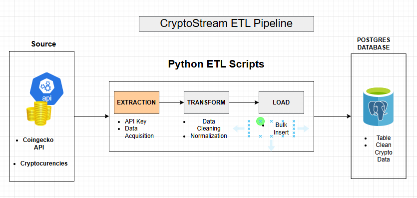

# CryptoStream ETL Pipeline

A Python-based ETL (Extract, Transform, Load) pipeline that fetches cryptocurrency market data from the CoinGecko API, processes it, and loads it into a PostgreSQL database. The pipeline is automated using Windows Task Scheduler.

---

## 🚀 Overview

This project demonstrates a real-world data engineering workflow:
- API data ingestion
- Data cleaning and transformation
- Database loading with UPSERT logic
- Automation on Windows
- Environment variable management
- GitHub-ready structure

---

## 🏗️ Architecture Diagram




---

## 📂 Project Structure

CryptoStream_Pipeline/
│── extract.py # Extract data from CoinGecko API
│── transform.py # Transform and clean data
│── load.py # Load data into PostgreSQL
│── main.py # Orchestrates ETL steps
│── run_pipeline.bat # Automation via Task Scheduler
│── .env # Environment variables (ignored by git)
│── README.md # Project documentation
│── etl_log.txt # Execution logs

yaml
Copy code

---

## ⚙️ Setup Instructions

### 1️⃣ Clone the repository
```bash
git clone https://github.com/<your-username>/CryptoStream_Pipeline.git
cd CryptoStream_Pipeline
2️⃣ Create and activate virtual environment
bash
Copy code
python -m venv venv
venv\Scripts\activate
Install dependencies:

bash
Copy code
pip install pandas requests python-dotenv psycopg2
3️⃣ Create .env file
env
Copy code
COINGECKO_API_KEY=your_api_key
DB_HOST=localhost
DB_PORT=5432
DB_NAME=crypto_db
DB_USER=postgres
DB_PASSWORD="your_password"
.env is excluded from GitHub for security.

4️⃣ Create PostgreSQL table
sql
Copy code
CREATE TABLE IF NOT EXISTS coins_market (
    id TEXT PRIMARY KEY,
    symbol TEXT,
    name TEXT,
    current_price NUMERIC,
    market_cap NUMERIC,
    market_cap_rank INTEGER,
    total_volume NUMERIC,
    high_24h NUMERIC,
    low_24h NUMERIC,
    price_change_percentage_24h NUMERIC,
    last_updated TIMESTAMP
);
▶️ Running the Pipeline
Manual run
bash
Copy code
python main.py
Automated (Windows)
Double-click run_pipeline.bat

Or schedule it using Windows Task Scheduler

Execution logs are stored in etl_log.txt.